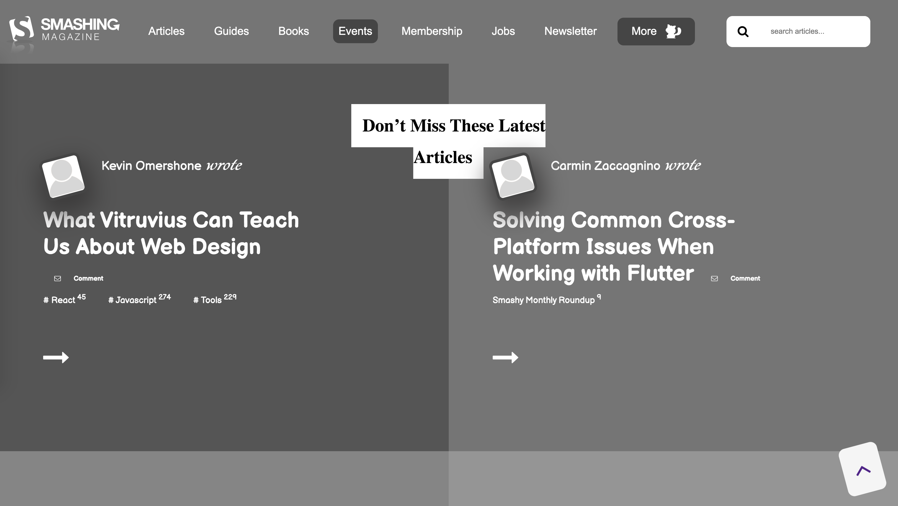

# Design Teardown

> Microverse Collaborative Project (Ramin and Alexes)

Additional description about the project and its features.

## Built With

- HTML,
- CSS,

## Live Demo

[Live Demo Link](https://rawcdn.githack.com/RaminMammadzada/design-teardown/0885751b7dacf87a053c6e139150b36de1b99825/index.html)

## Getting Started

**Navigation bar**
- Go to [the NYT article in question ](https://www.nytimes.com/2014/03/18/science/space/detection-of-waves-in-space-buttresses-landmark-theory-of-big-bang.html?_r=0) and have a look around. The form isn’t exceptionally complicat
This project consists of building a heatmap of the [Smashing magazine](https://www.smashingmagazine.com/) website
We have a cloned webpage built with following features:

In this project:
- The header, body and footer parts are created.
- Used float, flex and grid.
- Used shadow and gradients.
- HTML and CSS animation features are used.

To get a local copy  and to set it up and running follow these simple example steps.

### Prerequisites

- Browser
- Internet

- Download the code from repository (https://github.com/umairarshadbutt/Positioning-and-Floating-Elements) and double click the index.html file

## Authors

👤 **Ramin Mammadzada**

- Github: [@raminmammadzada](https://github.com/raminmammadzada)
- Twitter: [@raminmammadzada](https://twitter.com/raminmammadzada)
- Linkedin: [raminmammadzada](https://linkedin.com/raminmammadzada) 

👤 **Pablo Alexis Zambrano Coral**

- Github: [@Alexoid1](https://github.com/Alexoid1)
- Twitter: [@pablo_acz](https://twitter.com/pablo_acz)
- Linkedin: [linkedin](https://www.linkedin.com/in/pablo-alexis-zambrano-coral-7a614a189/)

## Show your support

Give a ⭐️ if you like this project!

## Acknowledgments

- Hat tip to anyone whose code was used
- Inspiration
- etc

## 📝 License

This project is [MIT](LICENSE) licensed.# design-teardown
